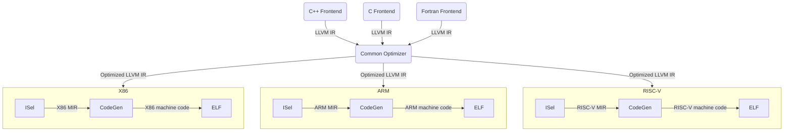
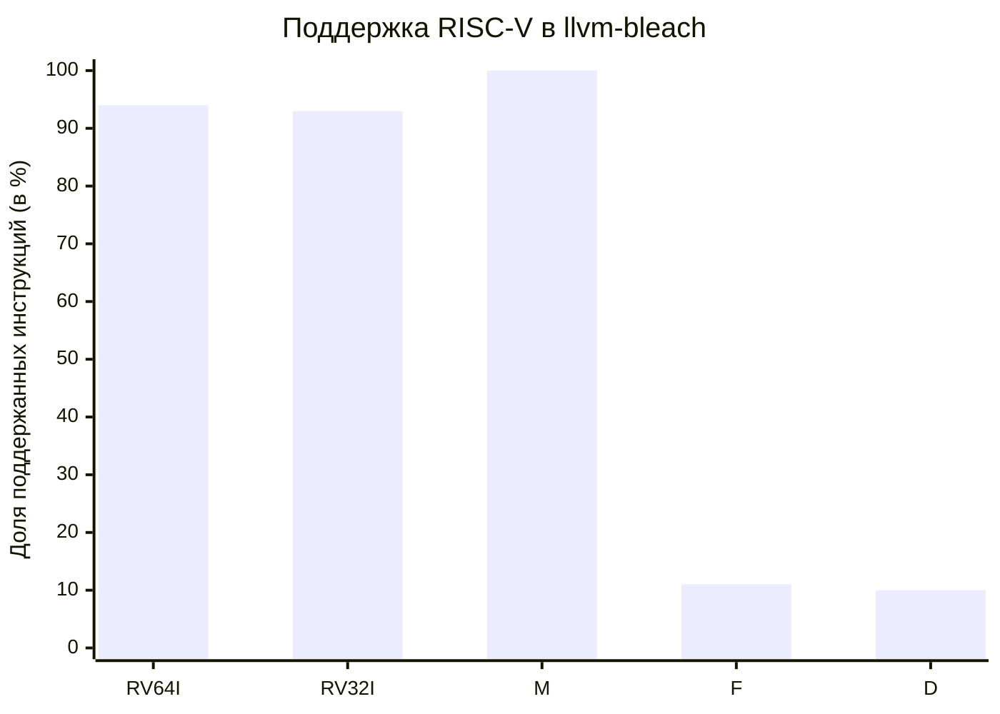

Цели и Задачи
===

# Цель
+ Разработать инструмент для восстановления LLVM IR из машинного кода RISC-V

# Задачи
+ Изучить существующие подходы к подъёму машинного кода в высокоуровневое представление
+ Разработать модель для семантического переноса RISC-V кода для RV64IM
+ Разработать инструмент переноса кода на основе инфраструктуры LLVM

<!-- end_slide -->

Компилятор LLVM
===



<!-- end_slide -->

Уровни IR
===

<!-- column_layout: [1, 1] -->
<!-- column: 0 -->
# High Level IR (HIR)
+ Высокоуровневое представление
+ Не зависит от языка програмирования
+ Не зависит от архитектуры
+ Виртуальные инструкции и регистры
+ Машинно-независимые оптимизации
+ LLVM IR


<!-- column: 1 -->
# Low Level IR (LIR)
+ Низкоуровневое представление
+ Специфично для архитектуры
+ Физические регистры
+ Конкретные инструкции целевой архитектуры
+ Оптимизации машинного уровня
+ LLVM MIR
<!-- end_slide -->

Бинарные трансляторы
===

<!-- column_layout: [1, 1] -->

<!-- column: 0 -->

# Обычные
+ Специализированное низкоуровневое представление
+ Сложная поддержка новых целевых архитектур
+ Cопостовление регистров
+ Cопоставление инструкций

<!-- column: 1 -->
# LLVM-based
+ Подъём в LLVM IR
+ Развитая инфраструктура анализа и инструментации

<!-- reset_layout -->
<!-- column_layout: [1, 1] -->
<!-- column: 0 -->
## Примеры
+ Rosetta 
+ QEMU
+ Berberis
<!-- column: 1 -->
## Примеры
+ mcsema
+ mctoll
+ instrew
+ rellume -
единственный поддерживает RISC-V (197 инструкций)

<!-- end_slide -->

Общие принципы
===

# Каждой инструкции сопоставляется функция
+ Входной операнд -> аргумент
+ Результат -> возвращаемое значение
<!-- column_layout: [1, 1] -->

<!-- column: 0 -->
## Инструкция
```bash
$x1 = ADD $x2, $x3
```
<!-- column: 1 -->
## Функция
```c
define i64 @ADD(i64 %0, i64 %1) {
    %3 = add i64 %1, %0
    ret i64 %3
}
```
<!-- end_slide -->

Преобразование кода
===

<!-- column_layout: [1, 1] -->

<!-- column: 0 -->
# Блок MIR (RISC-V)
```bash
bb.1:
  $x19 = MUL $x7, $x2
  $x28 = ADD $x21, $x19
  $x13 = ADD $x13, $x1
  BNE $x13, $x3, %bb.1
```
<!-- column: 1 -->
# Получившийся LLVM IR
```c
bb1:
%19 = call i64 @MUL(i64 %x7, i64 %x2)
%x28 = call i64 @ADD(i64 %x21, i64 %19)
%13 = call i64 @ADD(i64 %x13, i64 %x1)
%cmp = icmp ne i64 %13, %x3
br i1 %cmp, label %bb1, label %bb2
```
<!-- reset_layout -->
# LLVM IR после подстановки функций
```c
bb1:
  %19 = mul i64 %x7, %x2
  %x28 = add i64 %x21, %19
  %13 = add i64 %x13, %x1
  %cmp = icmp ne i64 %13, %x3
  br i1 %cmp, label %bb1, label %bb2
```

<!-- end_slide -->

Преобразование функций
===

# Собственное соглашение о вызовах
Cтруктура состояния - единственный аргумент
```ruby +line_numbers
define void @foo(ptr %0) {
  %GPR = getelementptr %register_state, ptr %0, i32 0, i32 0
  ... # loading registers from state
  %x2_upd = add i64 %x2, -1
  ... # save updated registers to state
  call void @bar(ptr %0)
  ... # reloading registers from state
  %x23_upd = mul i64 %x16, %x14
  ... # save updated registers to state
  ret void
}
```

<!-- end_slide -->

Алгоритм
===

```python {1-14|13|9-11|5-8} +line_numbers
def lift(F: function):
  loadRegsFromState(F.StateArgument)
  for MBB in F:
    for I in MBB:
      if I.isCall():
        saveRegsToState(F.StateArgument)
        BB.insertCall(I.Callee, F.StateArgument)
        reloadRegs(F.StateArgument)
      else if I.isCondBranch():
        Cond = BB.insertCall(I.function, I.Src1, I.Src2)
        BB.insertBranch(Cond, I.ifTrue, I.ifFalse);
      else:
        Regs[I.Dst] = BB.insertCall(I.func, I.Src1, I.Src2)
  saveRegsToState(F.StateArgument)
```
<!-- end_slide -->

Результаты
===

<!-- column_layout: [2, 5] -->
<!-- column: 0 -->
# Поддержанные инструкции
+ RV64I/E: 50(94%)
+ RV32I/E: 42(93%)
+ M Ext: 12(100%)
+ F Ext: 4(11%)
+ D Ext: 4(10%)

<!-- column: 1 -->


<!-- end_slide -->

<!-- jump_to_middle -->

Спасибо за внимание!
---
